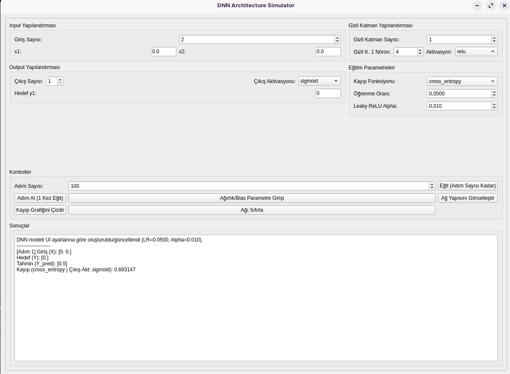
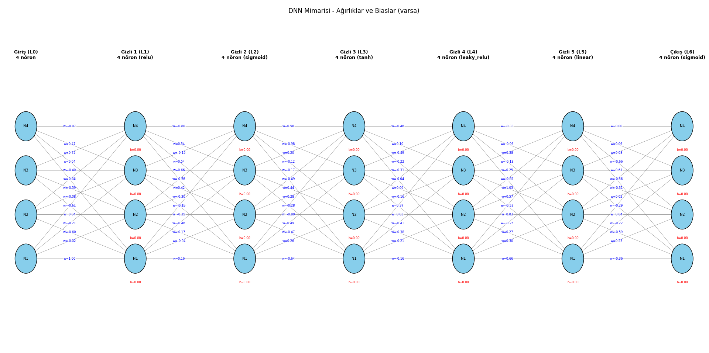
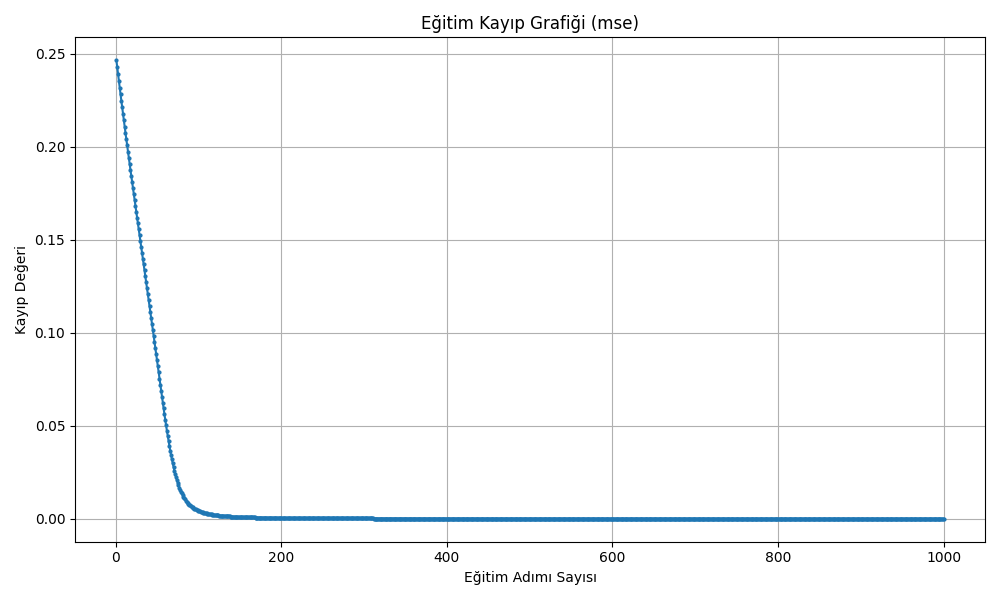

# DNN Mimarisi Simülatörü

Basit Derin Öğrenme Ağlarının (DNN'ler) simülasyonu ve görselleştirilmesi için PyQt5 ile oluşturulmuş grafiksel bir masaüstü uygulamasıdır. Bu araç öncelikli olarak eğitim amaçlı tasarlanmıştır; kullanıcıların bir DNN'nin temel bileşenlerini, ileri ve geri yayılım süreçlerini ve temel hiperparametrelerin etkisini anlamalarına yardımcı olur.

## Özellikler

*   **Yapılandırılabilir Mimari:** Giriş nöronlarının, çıkış nöronlarının ve gizli katmanların sayısını/boyutunu tanımlayın.
*   **Hiperparametre Seçimi:** Gizli katman aktivasyon fonksiyonlarını (ReLU, Sigmoid) ve kayıp fonksiyonlarını (MSE, MAE, RMSE, Cross-Entropy) seçin.
*   **Öğrenme Oranı Kontrolü:** Gradyan inişi (gradient descent) için öğrenme oranını ayarlayın.
*   **Adım Adım Eğitim:** Ağ davranışını artımlı olarak gözlemlemek için tekil eğitim adımlarını çalıştırın.
*   **Çoklu Adım Eğitim:** Belirtilen sayıda eğitim adımını tek seferde çalıştırın.
*   **Parametre İnceleme/Ayarlama:** Her katman bağlantısı için ağırlık (weight) ve bias değerlerini manuel olarak görüntüleyin ve değiştirin.
*   **Mimari Görselleştirme:** Nöronlar ve bağlantılar dahil olmak üzere ağ yapısının bir diyagramını görüntüleyin. Eğitimden veya manuel parametre girişinden sonra, ağırlıklar ve biaslar diyagram üzerinde gösterilir.
*   **Kayıp Grafiği:** Çalıştırılan adımlar boyunca eğitim kayıp geçmişini görselleştirin.
*   **Ağı Sıfırlama:** Ağın ağırlıklarını, biaslarını ve eğitim geçmişini sıfırlayın.

## Ekran Görüntüleri

Simülatörün çalışırkenki bazı örnekleri:

**Ana Kullanıcı Arayüzü:**


**Ağ Mimarisi Görselleştirmesi (parametrelerle):**


**Eğitim Kayıp Grafiği:**


## Kurulum

1.  **Depoyu klonlayın (veya dosyaları indirin):**
    ```bash
    # Git kullanıyorsanız
    git clone <depo-url'niz>
    cd <depo-dizini>
    ```
2.  **Sanal ortam oluşturun (Önerilir):**
    ```bash
    python -m venv venv
    # Ortamı etkinleştirin
    # Windows'ta:
    .\venv\Scripts\activate
    # macOS/Linux'ta:
    source venv/bin/activate
    ```
3.  **Bağımlılıkları yükleyin:**
    ```bash
    pip install -r requirements.txt
    ```

## Kullanım

1.  **Uygulamayı çalıştırın:**
    ```bash
    python main.py
    ```
    *(Alternatif olarak, eğer `main.py` sadece `ui.py`'yi çalıştırıyorsa, doğrudan `python ui.py` komutunu da kullanabilirsiniz).*

2.  **Ağı Yapılandırın:**
    *   "Input", "Output" ve "Gizli Katman Yapılandırması" bölümlerindeki kutucukları kullanarak ağ yapısını tanımlayın.
    *   İstenen giriş değerlerini (`x1`, `x2`, ...) ve hedef çıkış değerlerini (`Hedef y1`, ...) girin.

3.  **Eğitim Parametrelerini Ayarlayın:**
    *   İstediğiniz "Gizli K. Aktivasyonu" ve "Kayıp Fonksiyonu"nu seçin.
    *   "Öğrenme Oranı"nı ayarlayın.

4.  **Ağı Eğitin:**
    *   Tek bir eğitim iterasyonu gerçekleştirmek için **"Adım At (1 Kez Eğit)"** düğmesine tıklayın. Sonuçları "Sonuçlar" metin alanında gözlemleyin.
    *   "Adım Sayısı" kutusuna bir sayı girin ve birden fazla eğitim iterasyonu çalıştırmak için **"Eğit (Adım Sayısı Kadar)"** düğmesine tıklayın.

5.  **İnceleyin ve Görselleştirin:**
    *   Ağın ağırlıklarını ve biaslarını görüntülemek veya manuel olarak düzenlemek için **"Ağırlık/Bias Parametre Girişi"** düğmesine tıklayın. Değişiklikleri uygulamak için "OK" düğmesine basın (bu işlem ayrıca eğitim adım sayacını da sıfırlar).
    *   Mevcut ağ mimarisinin (ağ başlatılmış/eğitilmişse parametreler dahil) bir diyagramını görmek için **"Ağ Yapısını Görselleştir"** düğmesine tıklayın.
    *   Eğitim sırasında kaydedilen kayıp değerlerini çizdirmek için **"Kayıp Grafiğini Çizdir"** düğmesine tıklayın.

6.  **Sıfırla:**
    *   Mevcut ağ durumunu (ağırlıklar/biaslar) ve eğitim geçmişini temizlemek için **"Ağı Sıfırla"** düğmesine tıklayın.

## Bağımlılıklar

*   Python 3.x
*   NumPy
*   PyQt5
*   Matplotlib

(Detaylar için `requirements.txt` dosyasına bakın).
